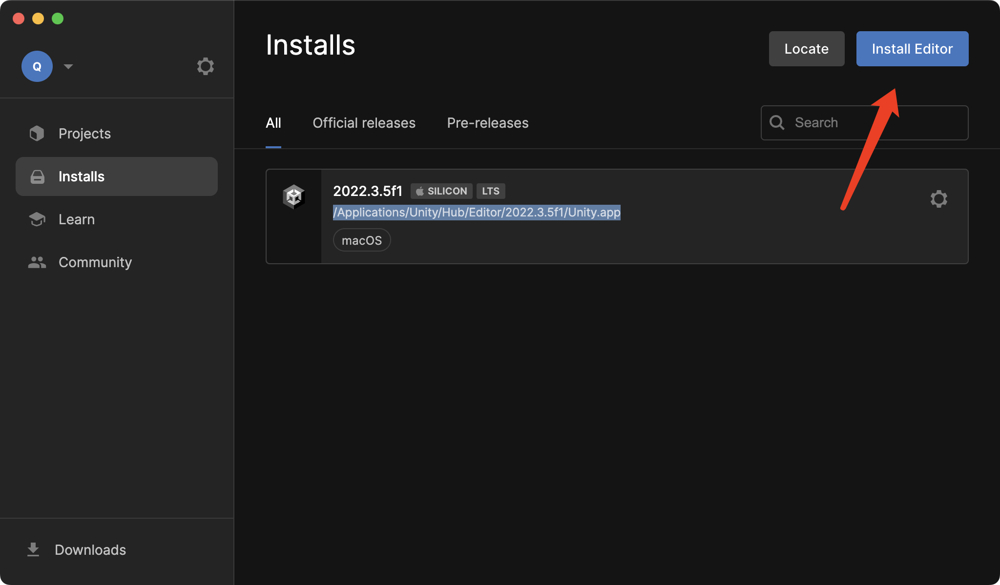
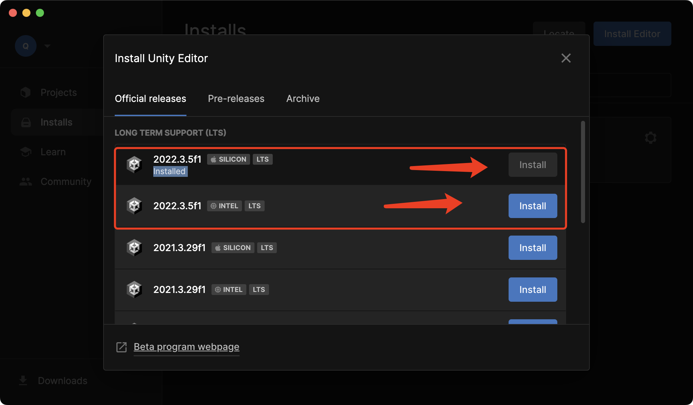
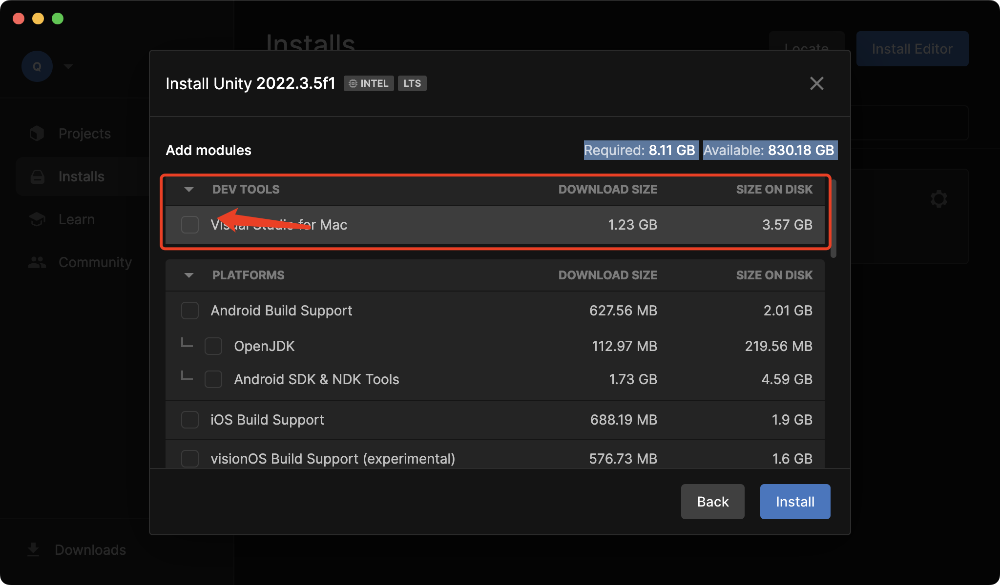
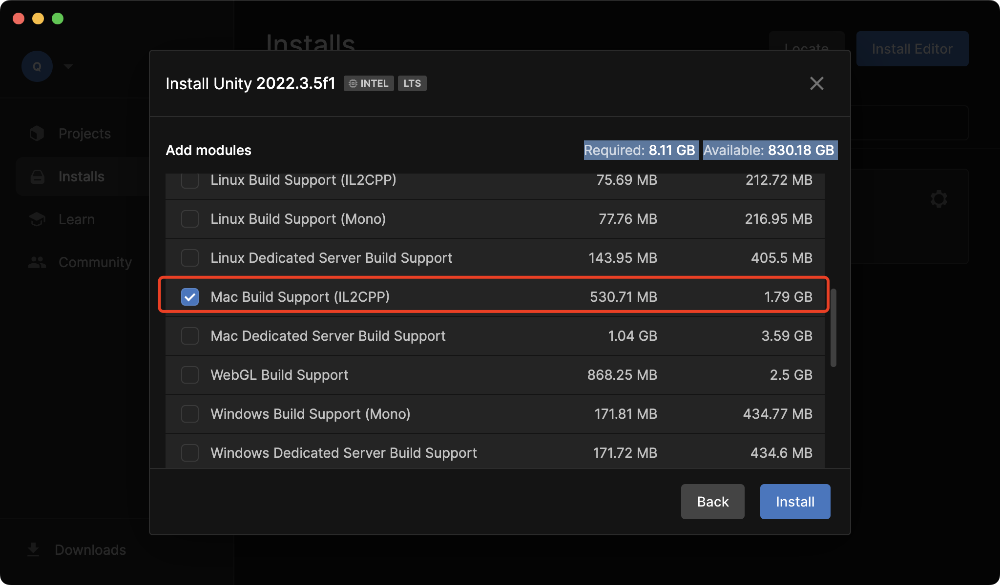

# 团团转工具文档

[TOC]

* Unity

  * 版本：2022.3.5f1
  * UnityHub：https://unity.com/cn/download

* Git

  * GUI：https://www.sourcetreeapp.com/
  * 工程Gamejam：https://gitee.com/qyjgit/dont-touch.git
  * 工程：https://github.com/qyjbeijing2017/EagleCatchesChicken.git

  

  ## Unity

  

  1. 下载UnityHubhttps://unity.com/cn/download并且安装
  2. 安装对应版本的Unity
  3. 选择对应版本的Unity
  4. 选择正确的模块
     1. 去掉没用的Visual Studio
     2. 有必要做导出的请勾选上对应版本的IL2CPP