# 团团转工具文档

[TOC]

* Unity

  * 版本：2022.3.5f1
  * UnityHub：https://unity.com/download

* Git

  * GUI：https://www.sourcetreeapp.com/
  * 工程Gamejam：https://gitee.com/qyjgit/dont-touch.git
  * 工程：https://github.com/qyjbeijing2017/EagleCatchesChicken.git


## Unity

1. 下载UnityHubhttps://unity.com/cn/download并且安装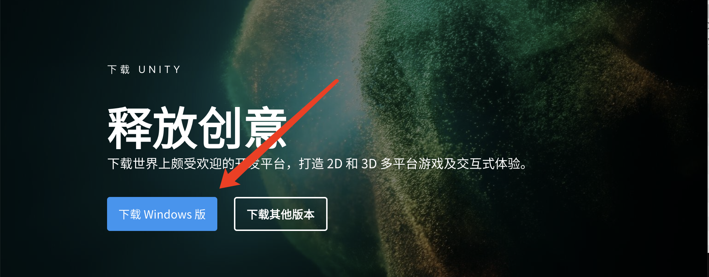
2. 安装对应版本的Unity
3. 选择对应版本的Unity
4. 选择正确的模块
   1. 去掉没用的Visual Studio
   2. 有必要做导出的（build）请勾选上对应版本的IL2CPP


## Git

1. 下载SourceTree，跟着步骤安装。
2. 使用自己的Github账户向程序申请权限。
3. 访问自己注册Github账户所使用的邮箱，找到Github发送的邀请邮件获得权限。
4. 使用git工具克隆工程。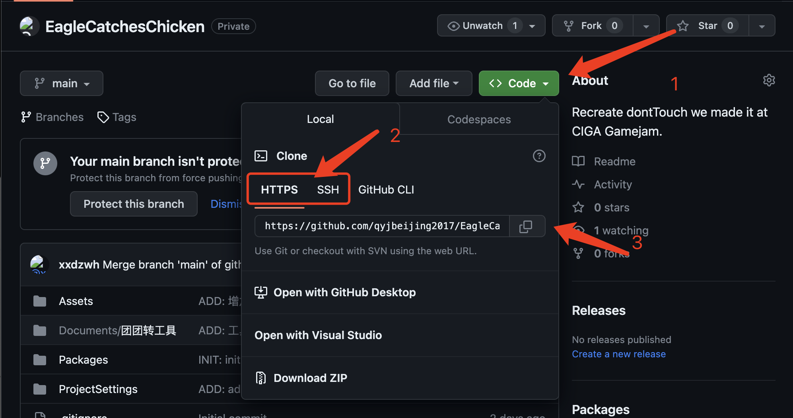


### 克隆

#### 使用https

1. 复制url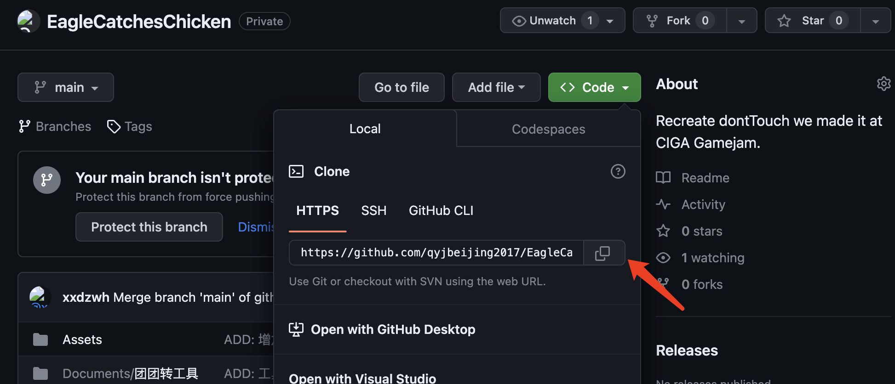

2. 使用GUI找到克隆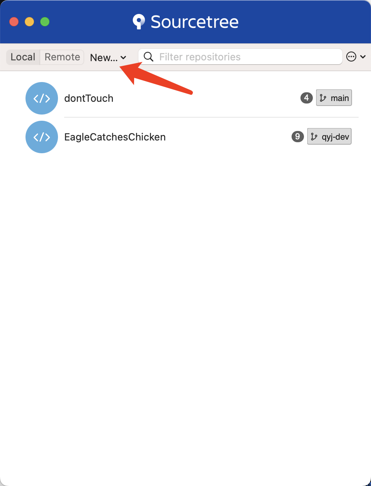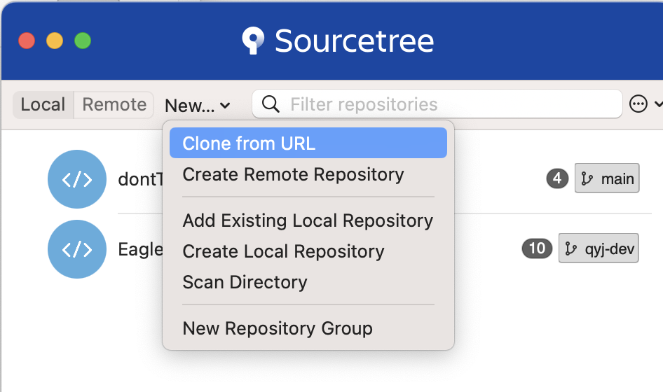

3. 克隆工程

   1. 粘贴刚刚Github复制的Url；
   2. 找到一个空的合适的文件夹；
   3. 命名这个工程方便在GUI中找到它；
   4. 关注这里用于验证Url是否正常
      * 不正常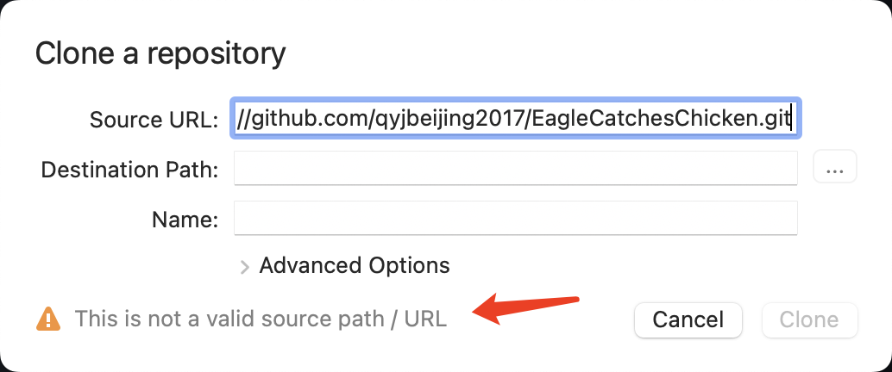
      * 鉴定中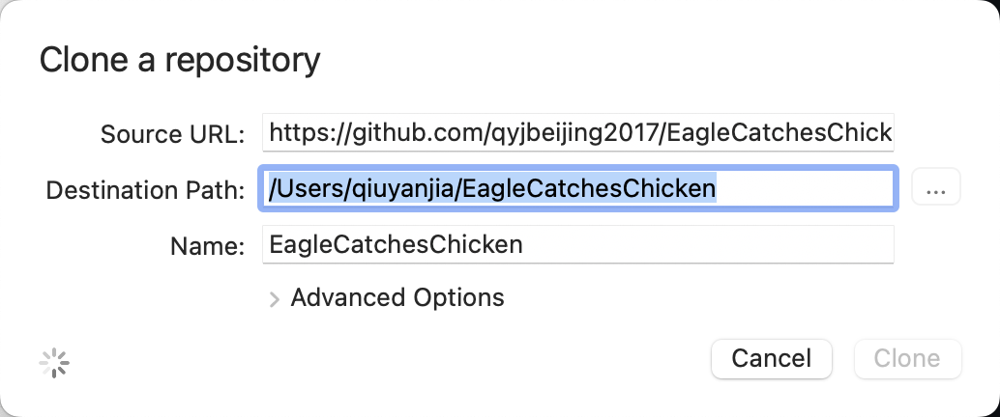
      * 可用
   5. 点击Clone下载


#### 使用ssh

1. 准备ssh密钥

   * 打开Terminal/命令行/PowerShell/终端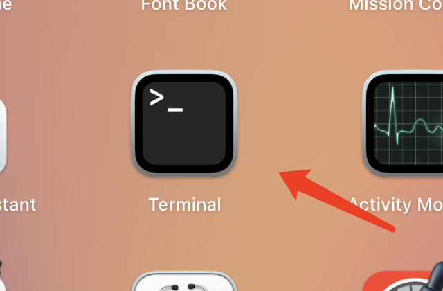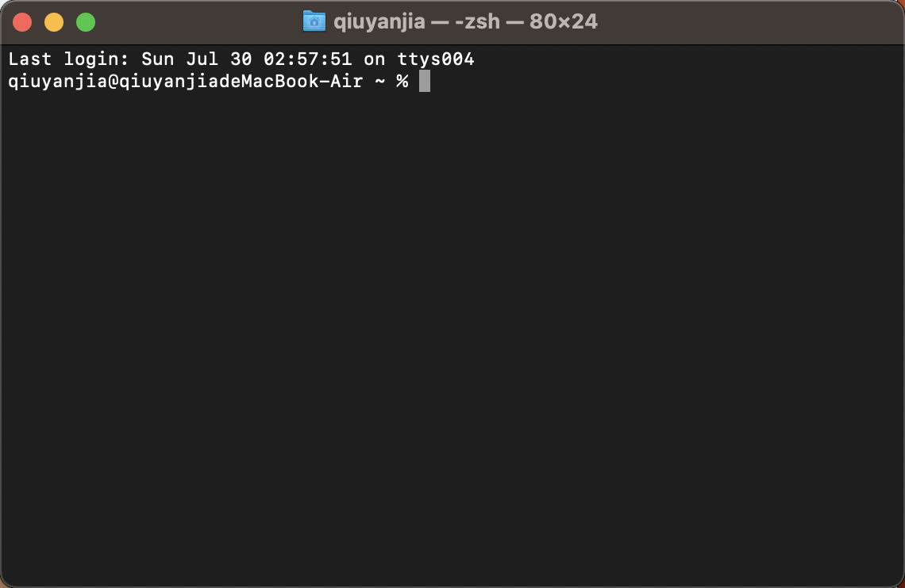
   * 输入生成ssh终端命令`ssh-keygen -t rsa -C "your_email@example.com"`注意修改自己的email，使用return/enter直到结束（全部使用默认）(Mac系统并且使用Sourcetree可以跳过这步)

   ```shell
   qiuyanjia@qiuyanjiadeMacBook-Air ~ % ssh-keygen -t rsa -C "your_email@example.com"
   Generating public/private rsa key pair.
   Enter file in which to save the key (/Users/qiuyanjia/.ssh/id_rsa): 
   Enter passphrase (empty for no passphrase): 
   Enter same passphrase again: 
   Your identification has been saved in /Users/qiuyanjia/.ssh/id_rsa
   Your public key has been saved in /Users/qiuyanjia/.ssh/id_rsa.pub
   The key fingerprint is:
   SHA256:41Lo11vGyCRyZVx8HLehnuzh+cWW1OkDU3zyJAJqx6Y your_email@example.com
   The key's randomart image is:
   +---[RSA 3072]----+
   |          .....o.|
   |         + o. =.o|
   |        o B .oo+o|
   |       o *  o.o=+|
   |      o E .  B oo|
   |     . = * oo B..|
   |      o o + ++ ++|
   |       o   +  ..o|
   |          .    . |
   +----[SHA256]-----+
   qiuyanjia@qiuyanjiadeMacBook-Air ~ % 
   ```

   * 找到自己的刚刚生成文件的位置（Mac系统跳过）

     * mac/linux: ```~/.ssh```
     * windows: `C:\Users\your_name\.ssh`

   * 找到刚刚生成的密钥，一般来讲名字是（Mac系统跳过）：

     * 私钥，`id_rsa`，用于给文件加密，用在客户端；
     * 公钥，`id_rsa.pub`，用于给文件解密，用在远端（Github）

   * 将私钥导入GUI

     * mac: `Source tree->Settings->Accounts`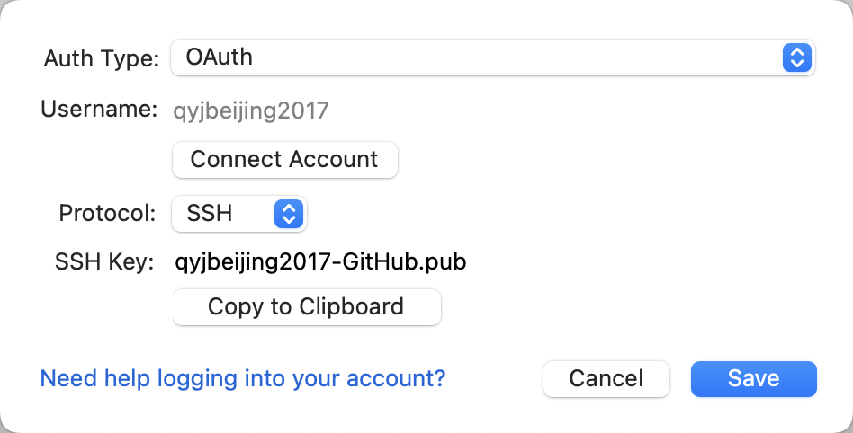
     * windows：`工具->选项->一般->SSH客户端配置`

   * 将公钥复制到Github

     * 在Github中，登陆你的账户；
     * 找到`你的头像->Settings->（左侧标题）Access->SSH and GPG keys`
     * 点击`New SSH key`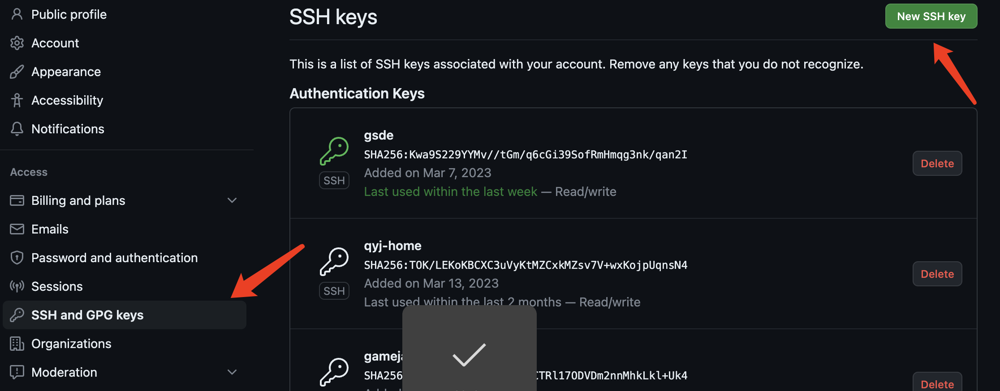
     * 输入对应信息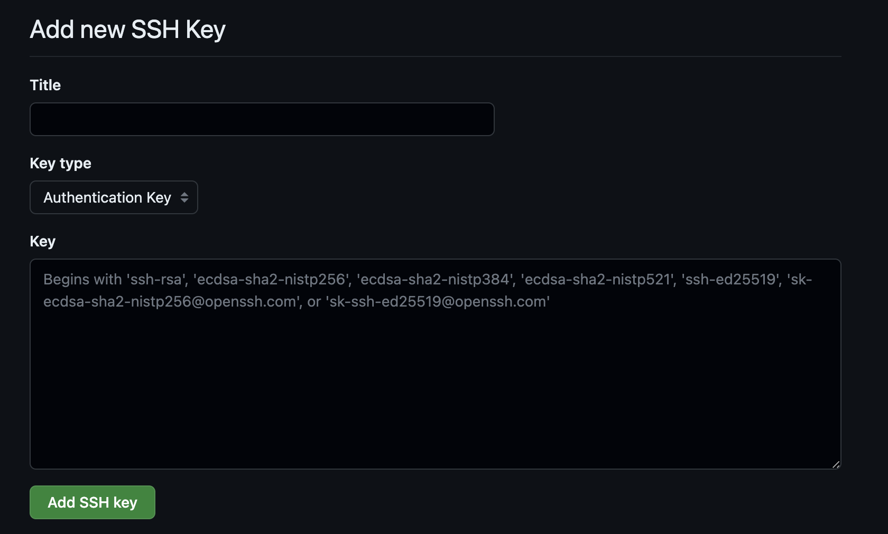
       * Title，你能懂的名字，标明你当前的这台电脑
       * Key，公钥
         * mac：`Source tree->Settings->Accounts->your_ssh->Copy to Clipboard`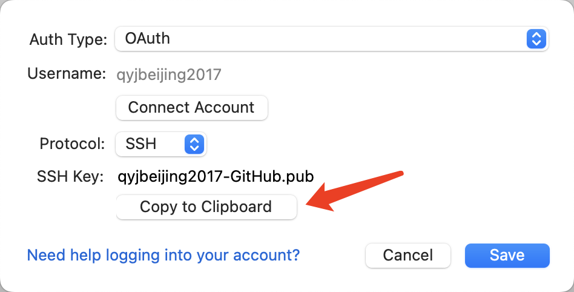
         * windows：刚刚*.pub中所有的内容

   * 克隆你的工程使用ssh，具体克隆过程请看https版本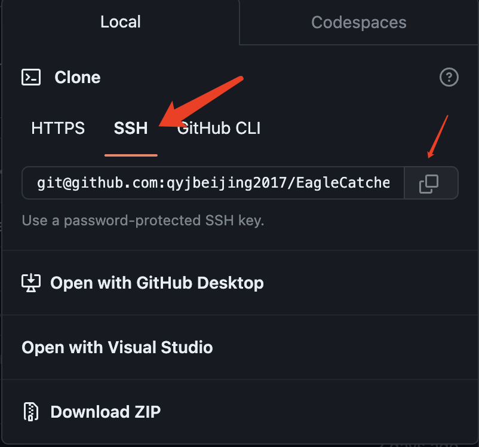


## Git靠谱教程收录（如果你希望了解的更清楚请直接跳转到这里）

   具体的git使用教程请查看：

* 廖雪峰，终端版本的原始git教程，一些基础概念，https://www.liaoxuefeng.com/wiki/896043488029600
* Sourcetree的使用教程，以及收录了一些工具的对比，https://www.cnblogs.com/Can-daydayup/p/13128633.html
* 视频，【狂神说Java】Git最新教程通俗易懂 https://www.bilibili.com/video/BV1FE411P7B3/?share_source=copy_web&vd_source=78d5b40571e8075c3fd3be5c1e52ed15

   
